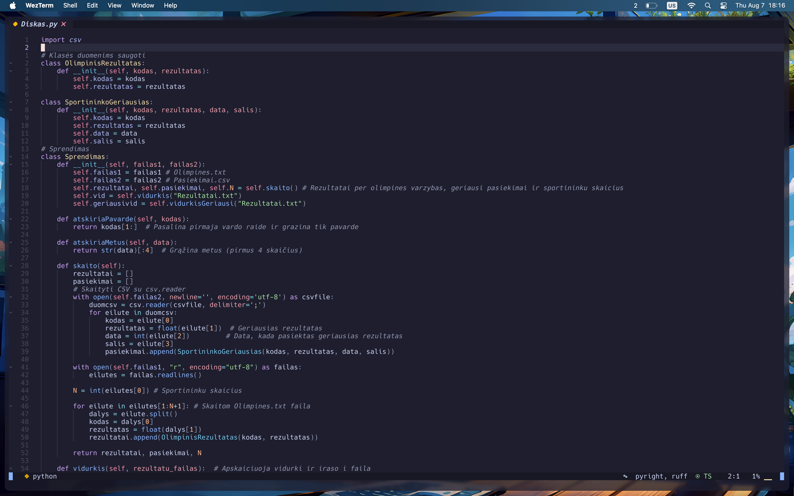
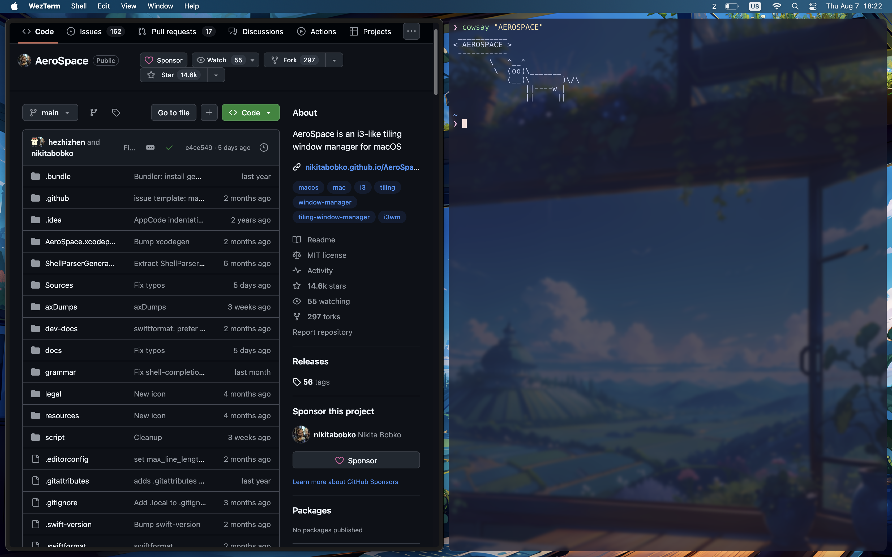
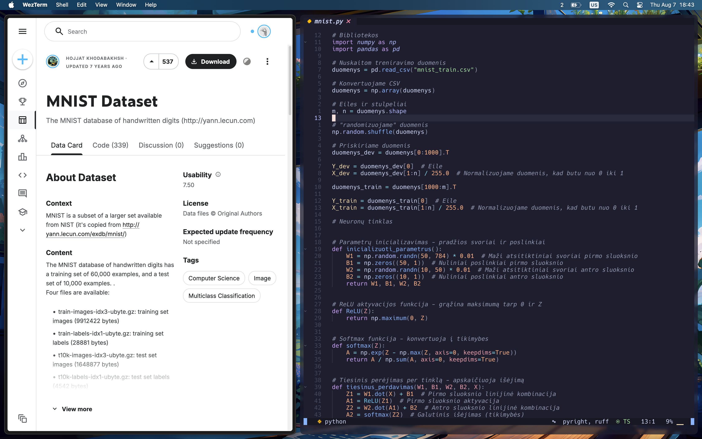

# 🏠 dotfiles

[](LICENSE)
[](https://www.apple.com/macos/)

✨ Personal development environment configurations managed with [GNU Stow](https://www.gnu.org/software/stow/).

## 📦 What's Inside

- **🎨 nvim** - Neovim editor configuration
- **💻 wezterm** - Terminal emulator settings  
- **🌈 oh-my-posh** - Shell prompt theming
- **🪟 aerospace** - macOS tiling window manager
- **⌨️ skhd** - Simple hotkey daemon
- **🐚 zshrc** - Zsh shell configuration

## 🚀 Installation

### Prerequisites
```bash
# Install GNU Stow
brew install stow
```

### 🎯 Quick Setup
```bash
git clone https://github.com/viliusjan/dotfiles.git ~/.dotfiles
cd ~/.dotfiles
stow */
```

### 🎛️ Selective Installation
```bash
# Install specific configurations
stow nvim     # 🎨 Editor
stow wezterm  # 💻 Terminal
stow zshrc    # 🐚 Shell
```

## 🔧 Management

### Remove Configuration
```bash
stow -D <package>   # 🗑️ Remove symlinks
```

### Update Configuration  
```bash
stow -R <package>   # 🔄 Restow package
```

### Check for Conflicts
```bash
stow -n <package>   # 🔍 Dry run (no changes)
```

## 📂 Structure

```
dotfiles/
├── 🎨 nvim/
│   └── .config/nvim/
├── 💻 wezterm/
│   └── .config/wezterm/
├── 🌈 ohmyposh/
│   └── .config/oh-my-posh/
├── 🪟 aerospace/
│   └── .config/aerospace/
├── ⌨️ skhd/
│   └── .config/skhd/
└── 🐚 zshrc/
    └── .zshrc
```

## 📸 Screenshots

### 🎨 Neovim Configuration

*AstroNvim-based configuration with custom plugins and theming*

### 💻 Terminal Environment

*WezTerm with Oh My Posh prompt and custom theme*

### 🪟 Window Management

*Aerospace window manager in action*

### 🎯 Complete Workspace

*Complete development environment overview*

## 💡 Tips

- 📝 Edit configs directly in the dotfiles directory (symlinks auto-sync!)
- 🔄 Run `stow -R <package>` after making changes
- 🛡️ Back up existing configs before installing

## 📄 License

MIT
